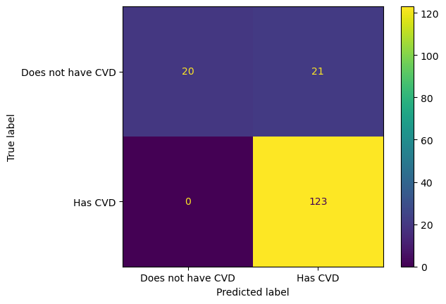
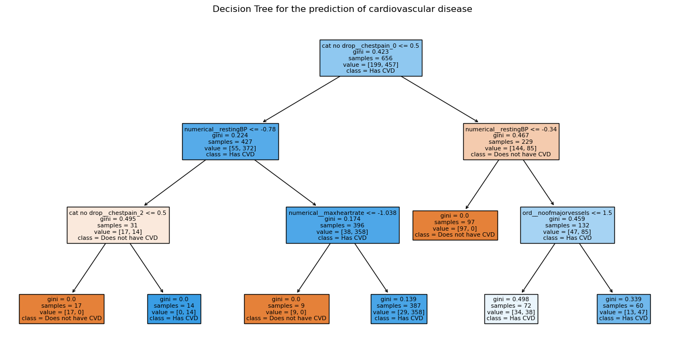
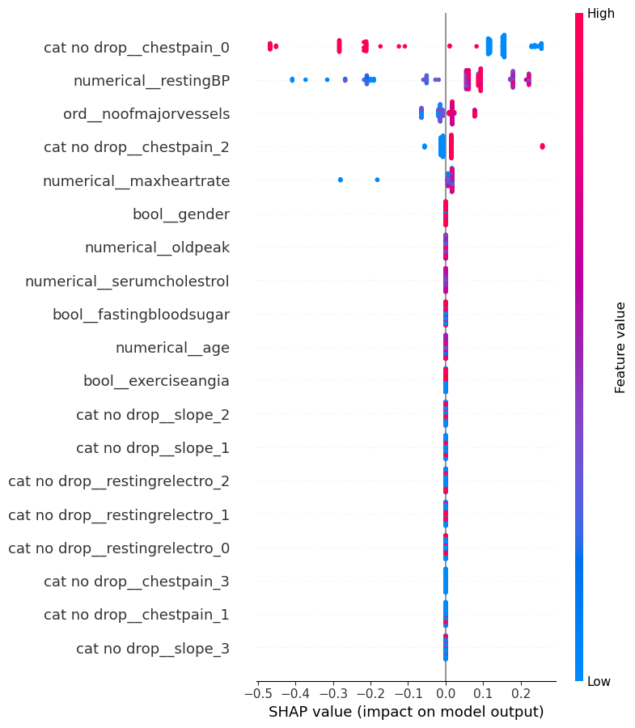
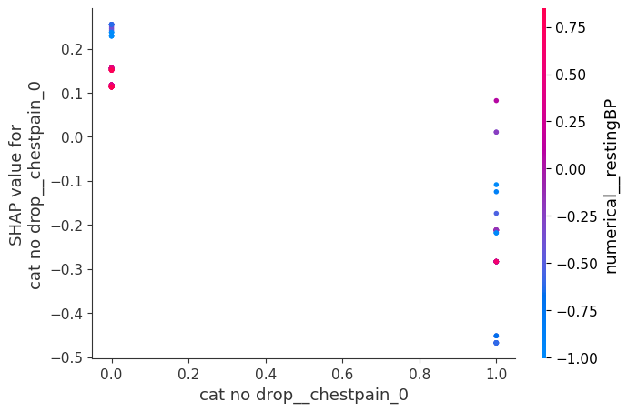
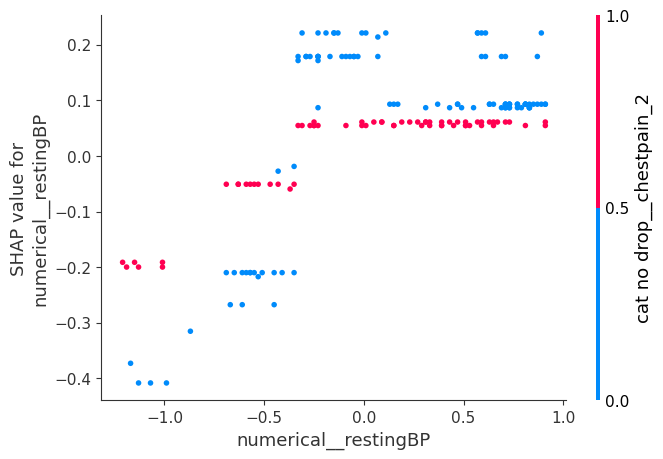

# Developing a machine learning model for the prediction of cardiovascular disease

## NON-TECHNICAL EXPLANATION OF YOUR PROJECT
This objective of this project is to develop a machine learning model to predict whether a patient has cardiovascular disease (CVD) or not.  Additionally, we aim to understand the key predictors of cardiovascular disease among a given set of clinical features.

## DATA
The dataset being used consists of 1000 rows of patient data.  For each patient, thirteen input variables and one output variable are populated, with the output variable being whether or not that patient has cardiovascular disease.  The input variables mostly relate to clinical data including numerical measurements (such as blood pressure), categorical elements (such as category of chest pain) and binary variables (such as whether the fasting blood sugar level is high or not).

I have sourced the dataset from:
https://www.kaggle.com/datasets/jocelyndumlao/cardiovascular-disease-dataset/data

The original dataset is from this source: https://data.mendeley.com/datasets/dzz48mvjht/1
(Doppala, Bhanu Prakash; Bhattacharyya, Debnath (2021), “Cardiovascular_Disease_Dataset”, Mendeley Data, V1, doi: 10.17632/dzz48mvjht.1)

Prior to training the model, 180 rows where the slope=0 were removed from the dataset as there was no reference to the meaning of these in the data card and four categories of slope are not common in the medical literature.  Given the size of this data subset and the implications of making assumptions about the meaning of slope=0, it was deemed necessary to remove these rows prior to further analysis.

## MODEL
The final model chosen for presentation is a decision tree. This was chosen on the basis of cross validation and testing results performed across a range of models.  Furthermore, the performance of models on gender subsets as well as the interpretability of the model were factors in the eventual choice of the decision tree classifier.

## HYPERPARAMETER OPTIMSATION
Two models were selected for hyperparameter optimisation.  Broadly speaking, this was based on overall performance evaluation from the previous phase as well as the objective of being able to interpret results intuitively.

The decision tree hyperparameters chosen for tuning were:

- max_depth:Integer(3,10)
- min_samples_leaf':Integer(2,5)
- ccp_alpha:Real(0.0,0.03)
- max_features:[None, 'log2', 'sqrt']
- splitter:['best','random']

The max depth was constrained to a maximum of ten as one of the reasons for choosing the decision tree was to be able to inspect the entire tree visually with ease.  So, it made sense to limit the longest decision path through the tree.  Additionally, a minimum number of leaf samples was included as a hyperparameter given the possibility of decision trees overfitting to training data.  I excluded the value of 1 from the range of minimum leaf samples allowed so that we did not end up with a complex decision trees with singular data points at the decision nodes.

The cost complexity parameter is a post-pruning method also designed to address overfitting.  Given I had already enforced bounds on other parameters to address overfitting, I allowed ccp alpha to be 0 (equivalent to no post-pruning) but included it in the mix of hyperparameters to tune in case post-pruning was found to yield additional benefits in the optimisation phase.  In a similar spirit, the max features (a pre-pruning method which limits the number of features that can be considered by the model when identifying a split and thus improves generalisation) was included in hyperparameter tuning. Again, the default value of being able to make use of all feature available was included in the mix of hyperparameters search space.

The BayesOptCV library was used to perform hyperparameter optimisation given the efficiency of Bayesian Optimisation in such an optimisation problem.  When running BayesOptCV, a particular performance score type is optimised for.  For example, in classification problems, this could be the overall accuracy of the classifier or something more precise such as the precision or recall rate.  The recall score (which tells us what proportion of the truly positive cases were classified as such by the model) was chosen as this is the most conservative approach for the domain of cardiovascular disease prediction - we are likely to care less about a few false alarms than missed cases.  Nonetheless, we continued to monitor the overall accuracy and the F1 score which gives a balanced assessment of true catches vs. false alarms.

## RESULTS

### The best model's performance

The confusion matrix produced by the best model can be seen here.

The optimisation of the decision tree parameters introduced an imbalance across the different score types.  We achieved 100% recall during cross validation and testing at the expense of overall accuracy.  (This imbalance was even more pronounced on the support vector machine model and was one of the reasons for not choosing it).

### Interpreting the best model

The optimal decision tree identified has a maximum depth of 3 and is easy to interpet with a visualisation.  It can be seen that the two input variables that are most predictive in the final classification are whether the patiens has chestpain in category 0 (i.e. typical angina) as well as their resting blood pressure.  Additionally, whether the patient has chestpain in category 2 (non anginal pain), the patient's maximum heartrate and the number of blocked major vessels identifed through fluroscopy all play a notable role in this decision tree's classification.

SHAP plots can help us visualise the overall impact of a given feature on the predicted classification as well as the interaction between variables.  

- The summary plot above again highlights the key predictors we identified in the decision tree - namely, chestpain category 0, resting BP, number of major vessels colored by fluroscopy and max heart rate.

- The chestpain category 0 and restingBP variables both exhibit the highest magnitude SHAP values suggesting they have the ability to strongly push the prediction of a given instance into the positive class or into the negative class.

- The wide range of values in SHAP values of chestpain category 0 and resting blood pressure suggest other factors are at play when it comes to understanding the influence of these two variables.  The dependence plot below provides more insight into this.

- From the dependence plots above, we can conclude that for a given value of category 0 chestpain, the variable that interacts most with it to predict the final outcome is the resting blood pressure (note the vertical axis on the right)  The opposite is not true - for a given value of blood pressure, the variable that interacts most with it is the present or not of category 2 chestpain.  

- Low values for chest pain category 0  i.e. where it is false, seems to push the value towards positive class as can be seen by the higher SHAP values here.  High value of chest pain category 0 ( i.e. True) cause the shap values to decrease pushing towards the negative class - especially when combined with a lower blood pressure.  

- There is a general positive correlation between resting blood pressure and SHAP value suggesting that higher blood pressure is correlated with postive CVD cases.  There are, however, distinct horizontal bands of blood pressure values within which the SHAP scores do not change significantly. Additionally, there is a marginal yet consistent impact on the blood pressure SHAP scores from the incidence of category 2 chest pain.  The presence of category 2 chestpain has a dampening effect on the predictive influence of blood pressure.

### Takeaway for health policy makers
- The combination of resting blood pressure and category of chestpain are significant in predicting cardiovascular disease.  

- Given these two indicators are easy to obtain from a patient without the need for advanced medical tests, there is an opportunity for a population health intervention to proactively identify possible cases of cardiovascular disease in the population of interest.  In the UK, for example, there is an initiative for cardiovascular disease identification in primary care - but this relies only on the patient submitting their blood pressure readings alone.  Incorporating a questionnaire into this process to account for chest pain could improve the accuracy of the process with little additional effort on the part of clinicians or patients.

- It is important to be mindful of the dataset on which this model was trained.  We do not know for sure the ethnicity of the patients but the data was collected from an Indian hospital and so its conclusions cannot immediately be applied to other populations.  However, it would be interesting to repeat this for other populations given the worldwide prevalence of CVD.
